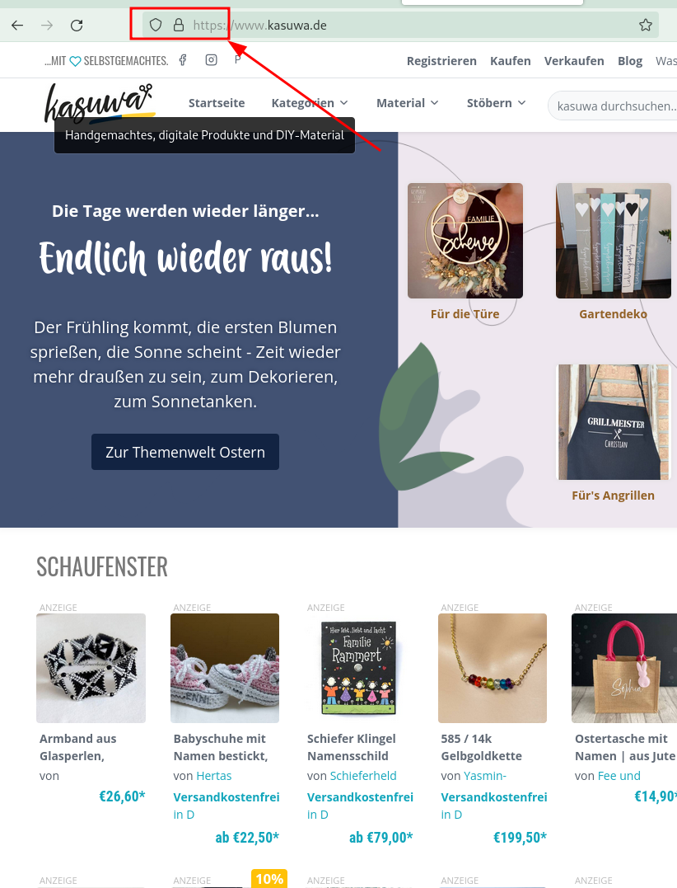

# Bezahlen im Internet

---

# Eure Fragen

Keine. 

---

# Agenda 

* Grundsätzliches I
* Grudnsätzliches II
* Wie kann man im Internet bezahlen?
* Exkurs 2FA
* Welche Bezahldienstleister gibt es?  
* Wie funktionieren sie? 

---

# Grundsätzliches

Wie erkenne ich einen seriösen Online Shop? 

* Ein Blick ins Impressum 
    * Impressum ist Pflicht! Seriöse Anbieter haben vollständige Kontaktdaten
* Plattformen 
    * Verkaufen "nur" ihre Vermittlungsdienstleistung möchten dich also als Kunden behalten. Ebay, Kasuwa, ....
* Große Marken Otto, Bertelsmann, etc. pp. 

---

# Grundsätzliches II

Technisches

* Verschlüsselte Verbindungen! (siehe Bild rechts) 
* Wie fühlt sich die Seite an, handwerklich gut gemacht? 

---

# Wie kann man im Internet bezahlen? 

* Rechnung 
    * Am sichersten, aber Risiko bei Händler, deshalb oft nicht möglich oder mit Gebühren
* Nachnahme
    * Bargeld beim Postboten, teilweise hohe Gebühren 
* Bankeinzug
    * Bezahlen vorher, aber das Geld kann 8 Wochen zurückgeholt werden
* Vorkasse
    * Vorher bezahlen, Risiko ist beim Kunden. Zurückbuchen schwer.
* Kreditkarte 
    * Relativ sicher, mittlerweile Second Factor (2FA) nötig um bezahlen zu können (siehe nächste Folie)

---

# Exkurs 2FA

*2FA oder Second Factor bedeutet: Es ist nicht ausreichend sich mit den angegeben Daten zu identifizieren. Es wird ein zweiter Faktor über einen anderen Kanal benötigt.* 

Bsp Kreditkartenzahlung: 
1. Fertig geshoppt, Warenkorb prüfen
2. Kreditkatendaten eingeben 
3. Es öffnet sich ein weiteres Fenster für einen zweiten Faktor. Bspsw. SMS TAN oder eine App üder die man bestätigen muss.

Was bringt das? 
Der erste Faktor ist unsicher, denn es ist einfach Kreditkartendaten zu ergaunern.
Wenn man einen zweiten Faktor dazunimmt, bei dem es relativ sicher ist, dass ihn ein Angreifer nicht ohne weiteres in seinen Besitz bringt (Smartphone, TAN Liste etc. pp.) wird es wesentlich sicherer.

---

# 2FA bildlich

---

# Welche Bezahldienstleister gibt es? 

* Paypal
* Paydirekt
* Giropay
* Sofortüberweisung
* Klarna
* Amazon Pay
* Gutschein Karten

---

# Bezahldienstleister I

* Paypal
    * Zwischen Händler und Kunde
    * Keine direkte Eingabe der Onlinebanking Daten
    * Händler erfahren nicht deine Kontodaten
    * Paypal Käuferschutz
    * Guthaben "aufladen" möglich
    * Ratenzahlung mit Gebühren

* Paydirekt 
    * Siehe Paypal
    * Von den deutschen Banken und Sparkassen

---

# Bezahldienstleister II

* Giropay 
    * Weiterleitung zum Onlinebanking und Überweisung ist direkt ausgefüllt und muss noch bestätigt werden

* Sofortüberweisung
    * Wie Giropay nur von einem schwedischen Anbieter (Klarna). 

---

# Bezahldienstleister III

* Klarna
    * Bündelt verschiedene bezahlarten wie Kreditkarte, Lastschrift, Sofortüberweisung oder Überweisung
    * Ratenzahlung mit Gebühren

* Amazon Pay
    * Ähnlich wie Paypal/Paydirekt
    * Kein anlegen eines neuen Kontos nötig wenn man schon ein Amazon Account hat. 

---
# Und jetzt?

### Kategorien

* Klassische Bezahlmethoden: Rechnung, Nachnahme, Bankeinzug, Vorkasse
* Halbklassisch: Kreditkarte
* Neuere Bezahlmethoden: Bezahldienstleister.

### Kategorien Bezahldienstleister

* "Zwischenhändler"/"Vermittler"
* Klassische Überweisung "vereinfachen"

---

# Vorteile/Nachteile

* *Klassische Methoden*
    * Allseits bekannt 
    * Gut wenn man unsicher ist im Umgang mit diesem IT Zeug

* *Kreditkarte*
    * Durch 2FA ziemlich sicher vor Missbrauch der eingegebenen Daten. 
    * Mit App einfach
    * Einrichtung der App ggf. aufwändig

---

# Vorteile/Nachteile II

* *"Zwischenhändler"/"Vermittler"*
    * Sehr einfach
    * Konto muss angelegt werden
    * Käuferschutz
    * Keine Angabe von Kreditkarten oder Kontonummern

* *Klassische Überweisung "vereinfachen"*
    * Einfach
    * Meist Onlinebanking nötig
    * Eingabe der Anmeldedaten fürs Onlinebanking bei manchen Anbieter wie bspsw. Sofortüberweisung (Warum ist das sicher, aber auch gefährlich?)

---