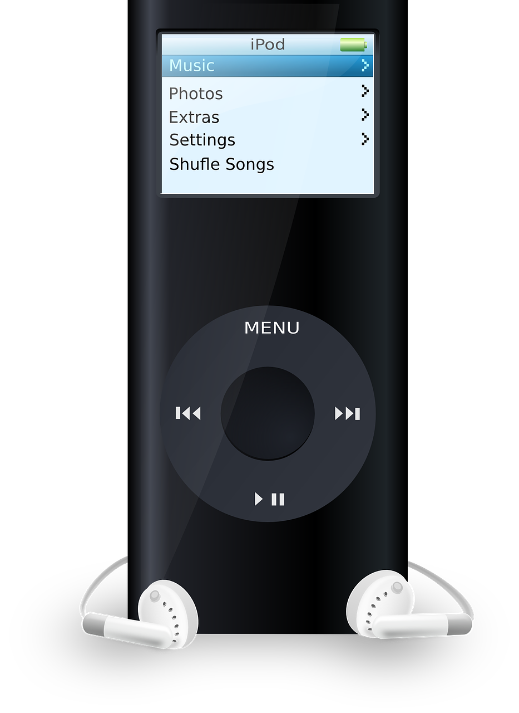
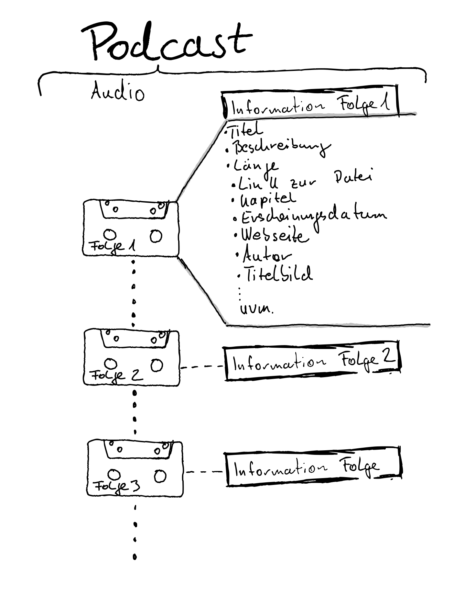
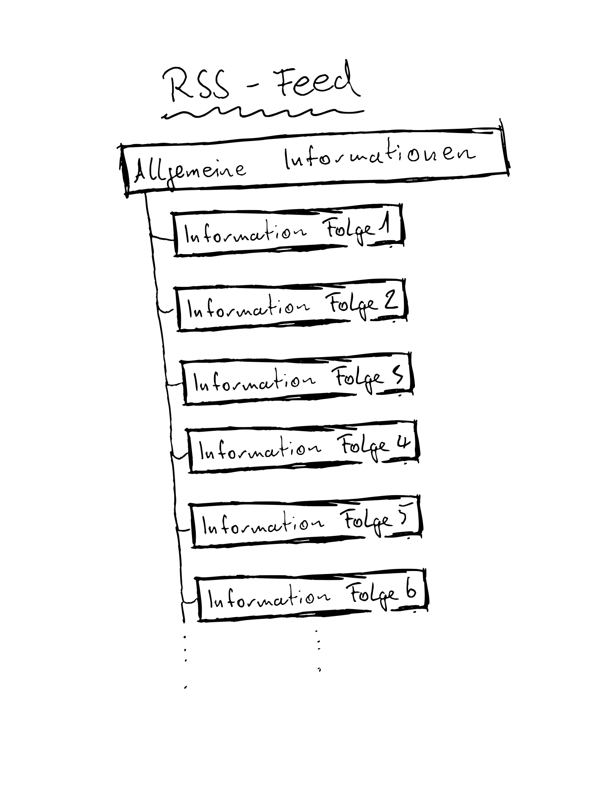

# Podcasts

---

# Eure Fragen

* Habe gesehen, dass es viele Anbieter von Podcasts gibt, Z.B. alle Sender haben so was. Sind die dann in Mediatheken oder muß man sich anmelden?
* Wie erkenne ich Profis, wie vermeide ich Quasselrunden? 

---

# Woher kommt der Name Podcast? 

* Pod von iPod 
(MP3-Player von Apple) 

* Cast von Broadcast (Rundfunk)

---

# Was sind eigentlich Podcasts? 

Wie eine "Radiosendung" auf Abruf und zum abonnieren.

---

# Wie kann man Podcasts abspielen? 

### Online Player

* https://www.podcast.de/
* [Spotify](https://open.spotify.com)

### Apps

* [AntennaPod (Android)](https://play.google.com/store/apps/details?id=de.danoeh.antennapod&hl=de)
* [Podcasts (Apple)](https://www.apple.com/de/apple-podcasts/) 

---

# Welche Podcasts gibt es und von wem? 

#### Was?
Talkrunden, Wissenschaft, Comedy, Religion, Reportagen, Geschichten, Geschichte, Psycholoie, True Crime uvm. 

#### Von wem?
Unternehmen, Privatpersonen, ÖRR, Wissenschaftler, Kirchen, Medienunternehmen uvm.

---

# Woher bekommt man Podcasts

Wie finde ich was ohne zugeschüttet zu werden? 

* In den o.g. Apps *gezielt* suchen
* Im "Internet" suchen
* https://podtail.com/de/top-podcasts/de/
* https://www.podcast.de/

Öffentlich rechtlicher Rundfunk
* [ARD Audiothek](https://www.ardaudiothek.de/) 
* ZDF -> verteilt über Podcast Portale und hat keine eigene Audiothek
* [Deutschlandfunk](https://www.deutschlandfunk.de/podcasts)

---

# Abonnements

Warum abonnieren?

Wie abonniere ich? 

<!-- Beispielpodcast -->

--- 

# Wissen für Angeber
* RSS Feeds 
* Kapitelmarken
* Shownotes
* Transskripte
* Kommentare

---

# Empfehlungen

* [Geschichten aus der Geschichte](https://www.geschichte.fm/)
* ["Kein Mucks!" - der Krimi-Podcast mit Bastian Pastewka](https://www.ardaudiothek.de/sendung/kein-mucks-der-krimi-podcast-mit-bastian-pastewka/77021218/)
* [Achtsam - DLF](https://www.deutschlandfunknova.de/podcasts/download/achtsam-mit-main-huong-und-diane)
* [SWR1 Leute](https://www.swr.de/swr1/bw/leute-bw-podcast-100.html)
* [Logbuch Netzpolitik](https://logbuch-netzpolitik.de/)
